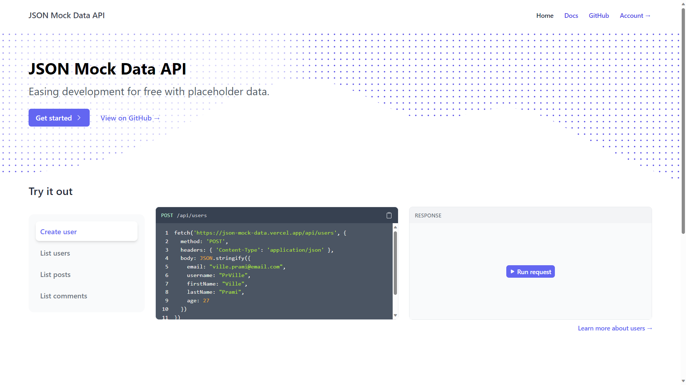
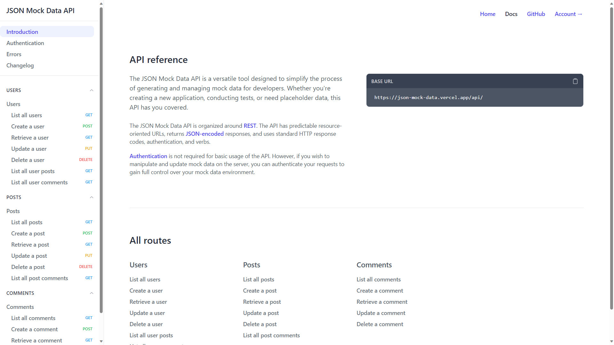
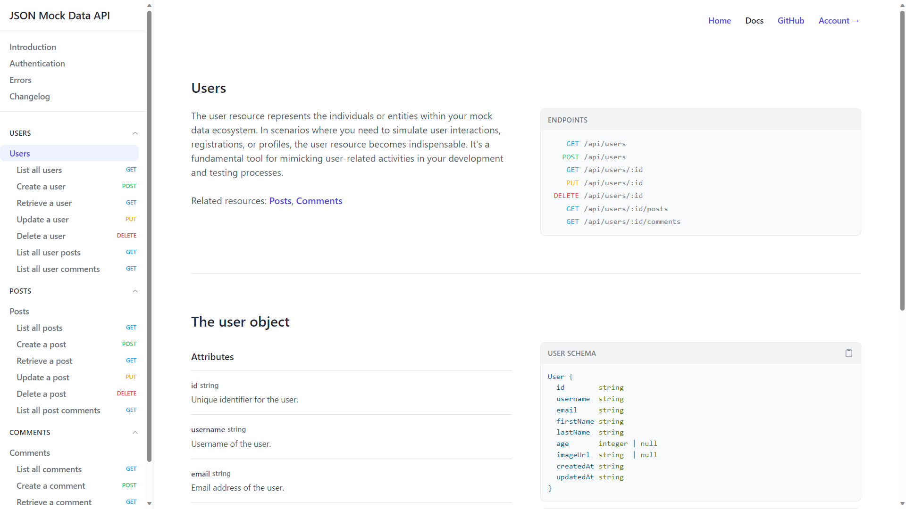
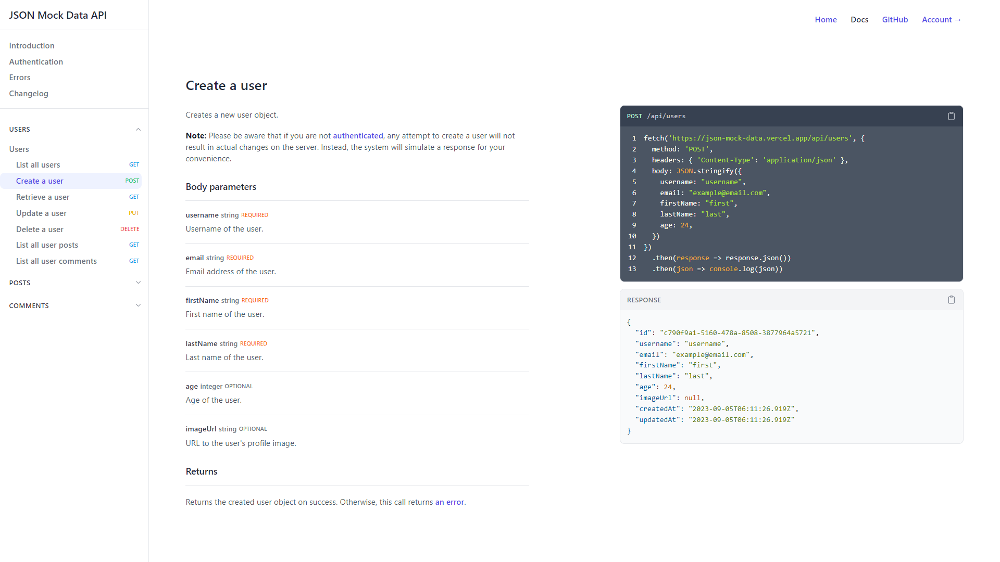
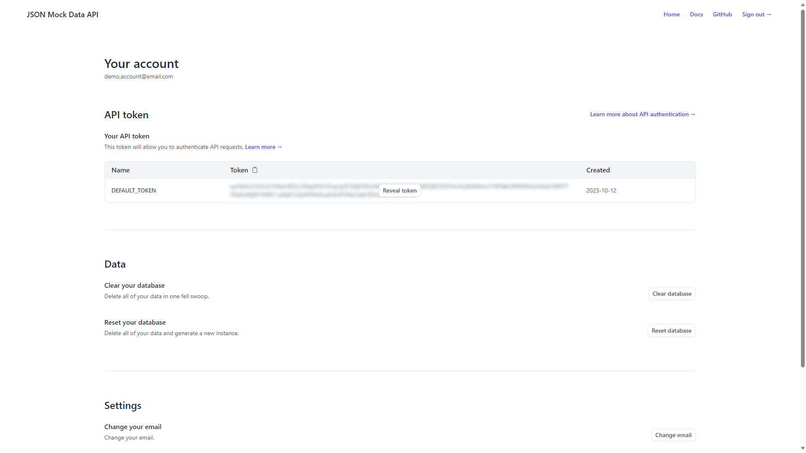

# JSON Mock Data API

The [JSON Mock Data API](https://json-mock-data.vercel.app/) is a free online REST API designed to simplify the process of generating and managing mock data for developers. Whether you're creating a new application, conducting tests, or need placeholder data, this API has you covered.

## Table of contents

- [Screenshots](#screenshots)
- [Resources](#resources)
- [Try it out](#try-it-out)
- [Links](#links)
- [Built with](#built-with)
- [Author](#author)

## Screenshots

<div align="center">
  
  
  
  
  
</div>

## Resources

- Users: [https://json-mock-data.vercel.app/api/users](https://json-mock-data.vercel.app/api/users)
- Posts: [https://json-mock-data.vercel.app/api/users](https://json-mock-data.vercel.app/api/users)
- Comments: [https://json-mock-data.vercel.app/api/users](https://json-mock-data.vercel.app/api/users)

...and more coming soon!

## Try it out

Try it out by fetching some [mock users](https://json-mock-data.vercel.app/api/users)!

    https://json-mock-data.vercel.app/api/users

```js
fetch('https://json-mock-data.vercel.app/api/users?take=3&sortBy=lastName')
  .then(response => response.json())
  .then(json => console.log(json))
```

See more: [https://json-mock-data.vercel.app/docs/](https://json-mock-data.vercel.app/docs/)

## Links

- Wesbite: [https://json-mock-data.vercel.app/](https://json-mock-data.vercel.app/)
- Docs: [https://json-mock-data.vercel.app/docs/](https://json-mock-data.vercel.app/docs/)
- API: [https://json-mock-data.vercel.app/api/](https://json-mock-data.vercel.app/api/)
- GitHub: [https://github.com/PrVille/json-mock-data-api](https://github.com/PrVille/json-mock-data-api)

## Built with

<p>
  
  
  
    
  
  
  
  
  
  
  
</p>

## Author

<p>
  <a href="https://villeprami.vercel.app/">
    
  </a>
  <a href="https://www.linkedin.com/in/ville-prami/">
    
  </a>
   <a href="https://www.codewars.com/users/PrVille" >
    
  </a>
  <a href="https://www.frontendmentor.io/profile/PrVille" >
    
  </a>
</p>
